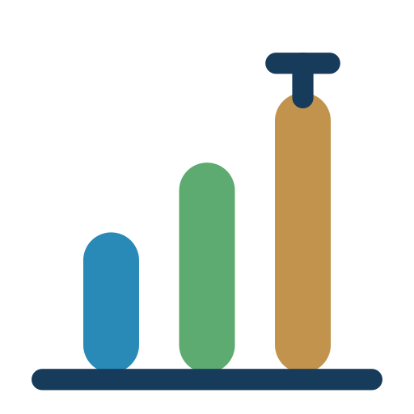

<p align="center"></p>

# Ranova

<p>
  <a href="https://github.com/Marlenildo/ranova-app/releases"></a>
  <a href="LICENSE"></a>
  = 4.1" src="https://img.shields.io/badge/R-%E2%89%A5%204.1-173b5b">
</p>

**Análise de variância de experimentos fatoriais** — digite ou importe seus dados e gere ANOVA, médias com letras, desdobramentos, gráficos e relatório em PDF.

Aplicativo [Shiny](https://shiny.posit.co/) que dá interface ao pacote R [`ranova`](https://github.com/Marlenildo/ranova).

## Funcionalidades

- **Entrada de dados**:
  - *Montar planilha*: informe de 1 a 3 fatores, os níveis, as repetições (ou blocos) e as variáveis resposta; o app monta a planilha com todas as combinações de tratamentos;
  - *Importar arquivo*: Excel (`.xlsx`, `.xls`, com escolha da aba) ou CSV (`;`, `,` ou tabulação);
  - *Colar*: cole direto as células copiadas do Excel ou de outra fonte, com ou sem linha de cabeçalho;
  - *Exemplo*: experimento fictício para conhecer o app.
- **Planilha editável**: cole direto do Excel (Ctrl+V), insira ou remova linhas; vírgula decimal aceita.
- **Estrutura sugerida automaticamente**: bloco, fatores e variáveis resposta são reconhecidos pelas colunas e podem ser ajustados.
- **DIC ou DBC**, com 1, 2 ou 3 fatores e uma ou mais variáveis resposta.
- **Resultados em abas**:
  - *ANOVA* em três formatos (QM com asteriscos, F e p em colunas, F (p)), com CV e leitura rápida dos efeitos e interações significativos;
  - *Pressupostos*: Shapiro-Wilk, Levene e gráficos de resíduos;
  - *Médias* com letras (teste t para 2 níveis, Tukey para 3 ou mais);
  - *Interação*: desdobramento com letras maiúsculas e minúsculas;
  - *Gráficos* de médias e de interação.
- **Painel de gráficos**: escolha as variáveis e a ordem, dê nomes aos eixos e legendas e monte um painel com quantos gráficos quiser, identificados por letras (A, B, C, D...).
- **Exportação dos gráficos** em PNG ou TIFF (LZW), com resolução de 150, 300 ou 600 dpi e tamanho em centímetros.
- **Relatório em PDF** (A4 retrato, no padrão do Croma, com cabeçalho branco): resumo do experimento, leitura rápida dos efeitos, pressupostos, ANOVA, médias, desdobramento da interação, gráficos numerados e o painel montado no app.

Os dados ficam apenas na sessão aberta: nada é gravado em banco de dados, arquivos ou cookies.

## Como executar

Requer R 4.1 ou superior.

```r
install.packages(c("shiny", "remotes", "rhandsontable", "readxl", "writexl", "png"))
remotes::install_github("Marlenildo/ranova")
shiny::runApp()
```

Ou direto do GitHub, sem baixar os arquivos:

```r
shiny::runGitHub("ranova-app", "Marlenildo")
```

## Publicação (Posit Connect Cloud)

O repositório inclui um `manifest.json` para publicar direto do GitHub em
[connect.posit.cloud](https://connect.posit.cloud) (**Publish → Shiny → repositório `Marlenildo/ranova-app`,
branch `main`, arquivo `app.R`**). O pacote `ranova` precisa estar instalado a partir do GitHub
(`remotes::install_github("Marlenildo/ranova")`) no momento de gerar o manifest:

```r
rsconnect::writeManifest(appPrimaryDoc = "app.R",
  appFiles = c("app.R", "global.R", "ui.R", "server.R", "DESCRIPTION",
               list.files("www", recursive = TRUE, full.names = TRUE)))
```

## Formato dos dados

Uma linha por parcela (unidade experimental) e uma coluna para cada informação:

| Bloco | Dose | Cultivar | Produtividade | Brix |
|---|---|---|---|---|
| 1 | 0 | A | 28,4 | 10,2 |
| 1 | 50 | A | 31,9 | 10,9 |
| … | … | … | … | … |

No DIC, a coluna de bloco pode ser trocada por uma de repetição (ela não entra no modelo).

## Estrutura

- `app.R`: ponto de entrada · `ui.R`: interface · `server.R`: lógica · `global.R`: leitura dos dados, análise, gráficos e relatório PDF
- `www/`: estilos e imagens · `scripts/gerar_logo_app.R`: gera a logo do app
- `DESCRIPTION`: versão e dependências · `CHANGELOG.md`: histórico · `CITATION.cff`: citação · `LICENSE`: licença MIT

## Versões e novidades

O projeto segue [Versionamento Semântico](https://semver.org/lang/pt-BR/). A versão atual está no arquivo
[`DESCRIPTION`](DESCRIPTION) e aparece no rodapé do app e do relatório. As mudanças de cada versão estão no
[`CHANGELOG.md`](CHANGELOG.md).

## Como citar

Veja o arquivo [`CITATION.cff`](CITATION.cff).

## Licença

MIT © Marlenildo
